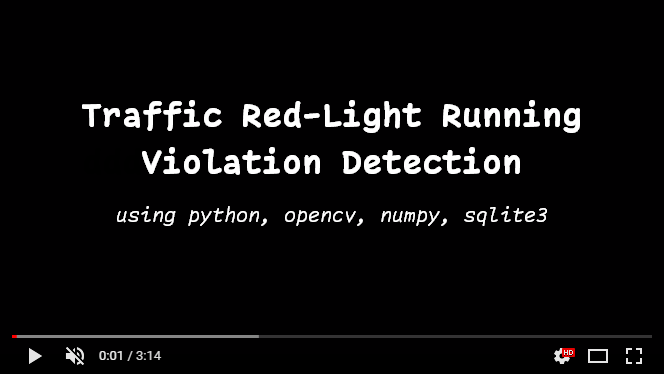

# Traffic Red-Light Running Violation Detection

## Description
This project is a car detection system that reads license plates when cars run a red light, stores the data in a database, and is implemented using classic image processing methods. The project consists of several sections:

### Line Detection Section
This section detects the line specified by the camera. If a car crosses this line when the traffic light is red, the system will penalize the car.

### Car or Object Detection Section
The car or object detection section uses various methods and techniques, including SIFT, Optical Flow, Mean Shift and CamShift, Contours and Blob Detection, and Haar cascade classifier. However, the best method tested for this video, which provided the most effective results, was Background Subtraction combined with Contour detection.

### License Plate Detection Section
This section identifies objects and checks if they contain a license plate. If a license plate is detected, it extracts the plate image.
[ref](https://github.com/ainyava/persian-license-plate-recognition)

### License Plate Image Enhancement Section
This section enhances the extracted license plate image using a set of image processing methods to improve image quality and facilitate edge detection.

### License Plate OCR Section
This section uses KNN to read the numbers and letters from the enhanced license plate image obtained from the previous section. It performs post-processing and validates the license plate data.
[ref](https://github.com/ainyava/persian-license-plate-recognition)

### Database and Table Creation Section
This section creates the necessary database and tables if they do not already exist.

### Storing Penalty in Database Section
This section records the license plate along with the time of the incident based on the video timestamp.

### Main Project Section
In this section, car or object detection is performed. The red, yellow, and green colors of the traffic light are also added to the frame. Detected cars are displayed in the frame, the crossing line is drawn, and the final video output is saved.

### Demo

[<a href="README-fa.md">خواندن توضیحات به فارسی</a>]

